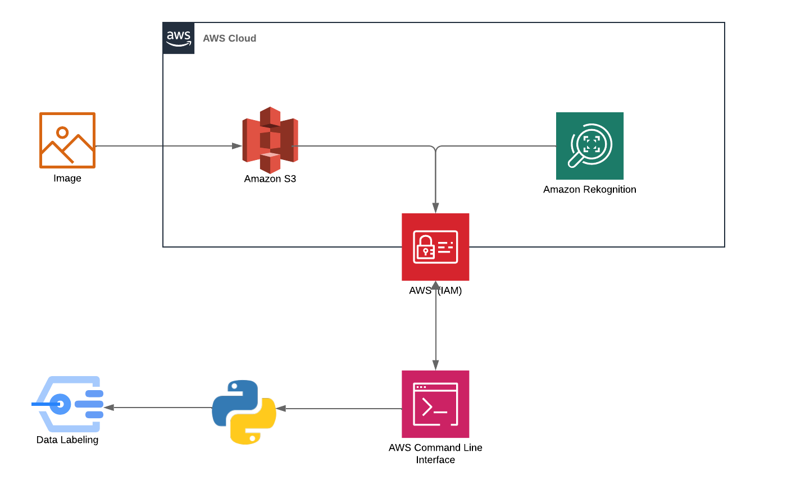

# Image Labels Generator with AWS Rekognition


I completed this project as part of my aws-cloud-journey practise to generate descriptive labels for images using  Amazon Rekognition. Upload an image to s3 bucket, and the application will return labels with relevant labels and their confidence scores.


## Getting Started

### Prerequisites

- **AWS Account**: You'll need an AWS account to access the required services.
- **AWS CLI**: Install and configure the AWS CLI on your local machine.
- **Python**: Make sure you have Python installed.
- **Boto3**: Install the AWS SDK for Python (`pip install boto3`).

### Installation

1. **Clone the Repository**:
    ```bash
    git clone https://github.com/your_username/image-labels-generator.git
    ```
2. **Set up AWS Credentials**: Configure your AWS credentials using the AWS CLI or environment variables.
3. **Create an S3 Bucket**: Create an S3 bucket to store the images you want to analyze.

## Usage



1. **Upload Image**: Upload the image you want to analyze to your S3 bucket.
2. **Run the Script**:
    - Replace placeholders in the Python file with your S3 bucket name and image file name.
    - Execute the Python script:
      ```bash
      python recognition_script.py
      ```

## How it Works

1. **Image Upload**: The image is uploaded and stored in an Amazon S3 bucket.
2. **Rekognition Analysis**: Amazon Rekognition processes the image, identifying objects and generating labels.
3. **Python Extraction**: The Python script retrieves the image from S3 and uses Rekognition's `detect_labels` operation to get the results.
4. **Output**: The script displays the top labels and their confidence levels.
5. **Visualization**: The code saves the image with bounding boxes around the detected labels.

## Potential Use Cases

- Image organiation and tagging
- Content moderation
- Accessibility enhancement
- Image search improvement
